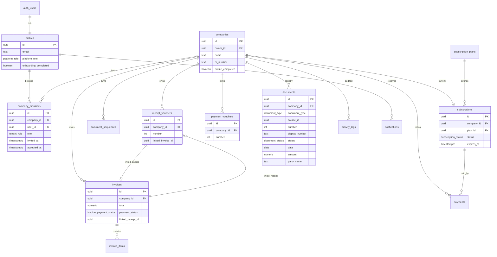

# Database Design

Production PostgreSQL schema for Sanadat multi-tenant SaaS (Supabase).

> **Status:** Proposed in `004_multi_tenant_production.sql` — not applied to production yet.

---

## Entity relationship diagram



---

## Core tables

### Identity & tenancy

| Table | Purpose |
|-------|---------|
| `profiles` | User profile extending `auth.users` |
| `companies` | Tenant root — business entity |
| `company_members` | User ↔ company membership with tenant role |
| `company_invitations` | Pending invites (email + token) |

### Documents

| Table | Purpose |
|-------|---------|
| `document_type_definitions` | Extensible type catalog |
| `document_sequences` | Atomic per-company numbering |
| `documents` | Unified registry (list/search/future types) |
| `receipt_vouchers` | Receipt voucher details |
| `payment_vouchers` | Payment voucher details |
| `invoices` | Invoice header |
| `invoice_items` | Invoice line items |

### Billing

| Table | Purpose |
|-------|---------|
| `subscription_plans` | Plan catalog (price, interval, limits) |
| `subscriptions` | Company subscription instance |
| `payments` | Gateway transactions |

### Platform & audit

| Table | Purpose |
|-------|---------|
| `notifications` | User notifications |
| `activity_logs` | Tenant audit trail |
| `whatsapp_templates` | Platform message templates |

---

## Enums

```sql
-- Platform (on profiles)
platform_role: platform_admin | platform_support

-- Tenant (on company_members)
tenant_role: owner | admin | accountant | viewer

-- Documents
document_type: receipt_voucher | payment_voucher | invoice
document_status: active | cancelled

-- Billing (unchanged from MVP)
subscription_status: active | expired | suspended | trialing
payment_status: pending | completed | failed | refunded
```

---

## Unified document registry

The `documents` table is the **index of all documents** for a company.

| Column | Description |
|--------|-------------|
| `id` | Same UUID as source row (shared PK) |
| `company_id` | Tenant scope |
| `document_type` | Enum |
| `source_table` | `receipt_vouchers` \| `payment_vouchers` \| `invoices` |
| `source_id` | FK to type table (same as `id`) |
| `number`, `display_number` | Denormalized for sorting/display |
| `status`, `date`, `amount`, `party_name` | List view fields |
| `metadata` | JSONB for type-specific summary (e.g. `payment_status` for invoices) |

**Sync:** PostgreSQL triggers on INSERT to type tables upsert into `documents`. On cancel, trigger updates registry status.

**Benefits:**
- Single query for dashboard recent documents
- Full-text search index on one table
- New document types register without changing list queries

---

## Row Level Security (RLS)

### Helper functions

```sql
-- Returns company IDs the current user belongs to
auth.user_company_ids() → SETOF uuid

-- Checks membership with minimum role
auth.user_has_company_role(p_company_id, p_min_role) → boolean

-- Platform admin bypass
auth.is_platform_admin() → boolean
```

### Policy pattern

```sql
-- Tenant read
USING (
  company_id IN (SELECT auth.user_company_ids())
  OR auth.is_platform_admin()
)

-- Tenant write (documents)
WITH CHECK (
  auth.user_has_company_role(company_id, 'accountant')
)
```

### Table policy summary

| Table | SELECT | INSERT | UPDATE | DELETE |
|-------|--------|--------|--------|--------|
| `profiles` | own + platform admin | own | own | — |
| `companies` | members + platform | owner signup | admin+ | — |
| `company_members` | members + platform | admin+ | admin+ | owner |
| `documents` | members | accountant+ | cancel fn only | — |
| `receipt_vouchers` | members | accountant+ | cancel fn only | — |
| `payment_vouchers` | members | accountant+ | cancel fn only | — |
| `invoices` | members | accountant+ | cancel fn only | — |
| `subscriptions` | members | system/webhook | system/webhook | — |
| `payments` | members | API route | webhook | — |
| `activity_logs` | members | system insert | — | — |

---

## Indexing strategy

### Hot paths

1. List documents for company (paginated, newest first)
2. Get document by ID within company
3. Active subscription for company
4. Member list for company

### Required indexes (004)

```sql
-- Registry (primary list/search)
CREATE INDEX idx_documents_company_created
  ON documents (company_id, created_at DESC);

CREATE INDEX idx_documents_company_type_created
  ON documents (company_id, document_type, created_at DESC);

CREATE INDEX idx_documents_company_status
  ON documents (company_id, status)
  WHERE status = 'active';

-- Type tables (detail + legacy queries)
CREATE INDEX idx_receipt_vouchers_company_created
  ON receipt_vouchers (company_id, created_at DESC);

CREATE INDEX idx_payment_vouchers_company_created
  ON payment_vouchers (company_id, created_at DESC);

CREATE INDEX idx_invoices_company_created
  ON invoices (company_id, created_at DESC);

-- Membership lookups (RLS)
CREATE UNIQUE INDEX idx_company_members_user_company
  ON company_members (user_id, company_id);

CREATE INDEX idx_company_members_company
  ON company_members (company_id);

-- Subscriptions
CREATE INDEX idx_subscriptions_company_status
  ON subscriptions (company_id, status);
```

### Full-text search (phase 2)

```sql
ALTER TABLE documents ADD COLUMN search_vector tsvector
  GENERATED ALWAYS AS (
    to_tsvector('simple', coalesce(display_number,'') || ' ' || coalesce(party_name,''))
  ) STORED;

CREATE INDEX idx_documents_search ON documents USING GIN (search_vector);
```

---

## Partitioning (future — millions of rows)

When a single document table exceeds ~5–10M rows:

```sql
-- Option A: RANGE by year (good for archival)
CREATE TABLE documents_2026 PARTITION OF documents
  FOR VALUES FROM ('2026-01-01') TO ('2027-01-01');

-- Option B: HASH by company_id (even spread)
CREATE TABLE documents_p0 PARTITION OF documents
  FOR VALUES WITH (MODULUS 8, REMAINDER 0);
```

Supabase supports declarative partitioning on PostgreSQL 15+. Plan before 1M rows; migrate with minimal downtime using logical replication or dual-write.

---

## Document numbering

Unchanged atomic function, extended for registry sync:

```sql
get_next_document_number(company_id, document_type, prefix_ar, prefix_en)
  → { number, display_number, display_number_en }
```

Rules:
- `document_sequences` row per `(company_id, document_type)`
- `ON CONFLICT DO UPDATE` increment — no gaps on rollback is acceptable; **reuse is forbidden**
- Display numbers stored at creation time (immutable)

---

## Data migration from 001 → 004

| Step | Action |
|------|--------|
| 1 | Add new columns/tables without dropping `user_id` |
| 2 | Backfill `owner_id = user_id` on companies |
| 3 | Insert `company_members (owner)` for each company |
| 4 | Backfill `documents` registry from existing vouchers/invoices |
| 5 | Replace RLS policies to use membership helpers |
| 6 | Deprecate `companies.user_id` (keep nullable, remove later) |
| 7 | Rename `profiles.role` → `platform_role` with data migration |

---

## TypeScript alignment

Domain types in `src/domain/` mirror this schema. Legacy `src/lib/types.ts` re-exports domain types during migration:

```typescript
// Future: src/lib/types.ts
export type { Company, ReceiptVoucher, ... } from '@/domain';
```

Generate DB types:

```bash
supabase gen types typescript --project-id <id> > src/infrastructure/supabase/database.types.ts
```

---

## Storage buckets

| Bucket | Path pattern | RLS |
|--------|--------------|-----|
| `company-assets` | `{company_id}/logo.webp` | Member read; admin write |
| `company-assets` | `{company_id}/stamp.webp` | Member read; admin write |
| `document-attachments` | `{company_id}/{document_id}/{file}` | Member read; accountant write |

---

## Related

- SQL migration: [`supabase/migrations/004_multi_tenant_production.sql`](../../supabase/migrations/004_multi_tenant_production.sql)
- Architecture overview: [multi-tenant-saas.md](./multi-tenant-saas.md)
