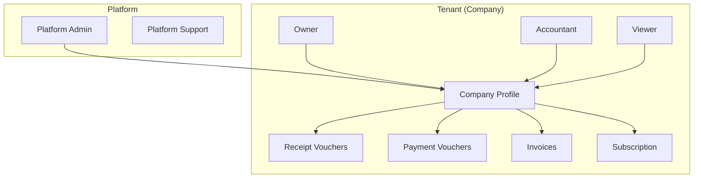
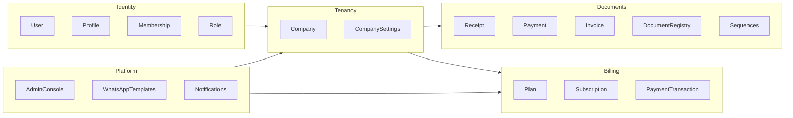
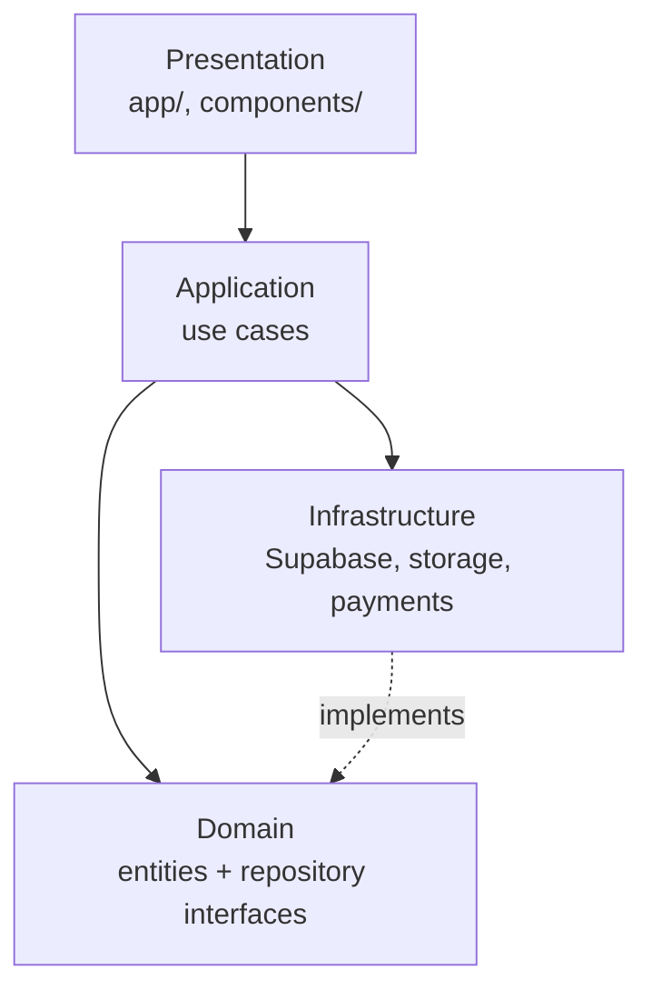

# Multi-tenant SaaS Architecture

## Overview

Sanadat evolves from a single-owner MVP into a **company-scoped multi-tenant SaaS** where:

- Each **company (tenant)** owns its documents, subscription, and settings.
- Multiple **users** can belong to one company with **tenant roles**.
- **Platform admins** operate outside tenant boundaries via a separate platform role.
- **Documents** remain immutable; cancellation is the only mutation.



---

## Tenancy model

| Concept | Implementation |
|---------|----------------|
| Tenant | `companies` row |
| Tenant isolation key | `company_id` on all tenant-owned tables |
| User identity | `auth.users` → `profiles` |
| Tenant membership | `company_members` (user ↔ company ↔ role) |
| Active tenant context | Session / cookie `active_company_id` (application layer) |
| Primary owner | `companies.owner_id` (creator, billing contact) |

### Isolation guarantees

1. **Database (primary)** — Row Level Security on every tenant table using `company_id IN (SELECT … FROM company_members WHERE user_id = auth.uid())`.
2. **Application (secondary)** — All repositories require an explicit `TenantContext { companyId, userId, role }`.
3. **Storage** — Supabase bucket paths prefixed with `{company_id}/`.
4. **Audit** — `activity_logs` always stores `company_id` + `user_id`.

### MVP → Production change

| MVP (001) | Production (004) |
|-----------|------------------|
| `companies.user_id` = sole owner | `companies.owner_id` + `company_members` |
| `profiles.role` = client \| admin | `profiles.platform_role` + tenant roles in `company_members` |
| Direct RLS via `user_id` | RLS via membership helper functions |
| 3 document tables only | 3 tables + unified `documents` registry |

---

## Bounded contexts



| Context | Responsibility | Key entities |
|---------|----------------|--------------|
| **Identity** | Auth, profiles, memberships, roles | `Profile`, `CompanyMember`, `TenantRole`, `PlatformRole` |
| **Tenancy** | Company profile, branding, settings | `Company` |
| **Documents** | Vouchers, invoices, numbering, links | `ReceiptVoucher`, `PaymentVoucher`, `Invoice`, `DocumentRegistry` |
| **Billing** | Plans, subscriptions, gateway payments | `SubscriptionPlan`, `Subscription`, `PaymentTransaction` |
| **Platform** | Admin ops, templates, cross-tenant views | Admin aggregates (read-only over tenants) |

---

## Layered architecture



### Domain (`src/domain/`)

Pure TypeScript. No Supabase, no React, no Next.js imports.

- Entities and value objects
- Repository **interfaces** (ports)
- Domain errors
- Document type registry constants

### Application (`src/application/`)

Use cases that orchestrate domain operations.

- `CreateReceiptVoucher`, `ListCompanyDocuments`, `GetActiveSubscription`
- Accepts `TenantContext` on every call
- Returns domain entities or DTOs
- Demo mode: swap infrastructure with in-memory/mock adapters later

### Infrastructure (`src/infrastructure/`)

Adapters implementing domain repository interfaces.

- `SupabaseReceiptRepository`
- `SupabaseCompanyMemberRepository`
- Storage, payment webhooks, PDF (stay in `lib/` until migrated)

### Presentation (`src/app/`, `src/components/`)

Thin UI. Existing components remain; pages gradually call application use cases instead of importing `mock-data.ts`.

---

## Document architecture

### Why type-specific tables + unified registry?

| Approach | Pros | Cons |
|----------|------|------|
| Single `documents` JSONB table | Flexible | Weak typing, harder indexes, invoice line items awkward |
| Separate tables only (MVP) | Strong schema, fast per-type queries | Dashboard needs UNION; new types touch many queries |
| **Hybrid (recommended)** | Best of both | Slight write duplication (registry sync via trigger) |

**Design:**

```
receipt_vouchers ──┐
payment_vouchers ──┼──► documents (registry) ──► dashboard / search / future types
invoices ──────────┘
     │
     └── invoice_items
```

The registry stores summary fields for listing. Detail pages fetch from type-specific tables.

### Future document types

1. Add row to `document_type_definitions` (code, prefixes, table name).
2. Create type-specific table (or extend pattern).
3. Add trigger to sync `documents` registry.
4. Register in `src/domain/documents/shared/document-type.ts`.
5. Add UI config in `components/documents/engine/registry.ts`.

Examples: delivery notes, quotations, credit notes.

### Document rules (unchanged)

- Sequential numbering per company + type (never reused)
- Status: `active` | `cancelled`
- No UPDATE on content fields after creation
- Links: receipt ↔ invoice via FK columns

---

## Roles & permissions

### Platform roles (`profiles.platform_role`)

| Role | Access |
|------|--------|
| `null` | Normal tenant user |
| `platform_admin` | Admin console, all tenants (read/manage) |
| `platform_support` | Read-only cross-tenant support |

### Tenant roles (`company_members.role`)

| Role | Documents | Settings | Billing | Members |
|------|-----------|----------|---------|---------|
| `owner` | CRUD* | Full | Full | Manage |
| `admin` | CRUD* | Full | View | Invite |
| `accountant` | CRUD* | View | View | — |
| `viewer` | Read | View | — | — |

*CRUD = create + read + cancel (not edit content)

Permission checks live in:
1. RLS policies (hard boundary)
2. Application use cases (UX / error messages)

---

## Scalability strategy

### Target scale

- **Thousands of companies** — standard PostgreSQL on Supabase Pro
- **Millions of documents** — indexing + optional partitioning

### Database

| Technique | When |
|-----------|------|
| Composite indexes `(company_id, created_at DESC)` | Now — all document tables |
| Partial indexes `WHERE status = 'active'` | Now — active document lists |
| `documents` registry | Now — unified recent/search |
| Table partitioning by `company_id` hash or `created_at` range | >10M rows per table |
| Read replicas | Heavy reporting / admin analytics |
| Connection pooling (Supabase Supavisor) | Production default |

### Application

| Technique | When |
|-----------|------|
| Cursor pagination on document lists | Now (replace offset) |
| Server Components + Supabase server client | Production pages |
| Edge cache for public/marketing only | Already static |
| Background jobs for PDF/archive | Future |

### Storage

- Company assets: `{company_id}/logo.png`, `{company_id}/stamp.png`
- Future document attachments: `{company_id}/attachments/{document_id}/`

---

## Demo mode compatibility

```
IS_DEMO_MODE=true  → MockRepository implementations (existing mock-data.ts)
IS_DEMO_MODE=false → SupabaseRepository implementations
```

The application layer interface stays identical. Pages import use cases, not mock data directly.

---

## Migration path from MVP

| Step | Risk | Description |
|------|------|-------------|
| 1 | Low | Add `docs/architecture/` + domain scaffold (this PR) |
| 2 | Medium | Apply `004` on staging; backfill `company_members` from `companies.user_id` |
| 3 | Medium | Generate Supabase types; implement repositories |
| 4 | Medium | Wire one page (e.g. receipts list) to use case |
| 5 | High | Switch auth middleware to membership-based RLS |
| 6 | High | Replace all mock imports; remove demo-only paths optionally |

Existing migrations `001`–`003` remain valid for early Supabase setups. Migration `004` is **incremental** and includes backfill steps.

---

## Related files

- [Database design](./database-design.md)
- Proposed SQL: `supabase/migrations/004_multi_tenant_production.sql`
- Domain layer: `src/domain/`
- Application layer: `src/application/`
