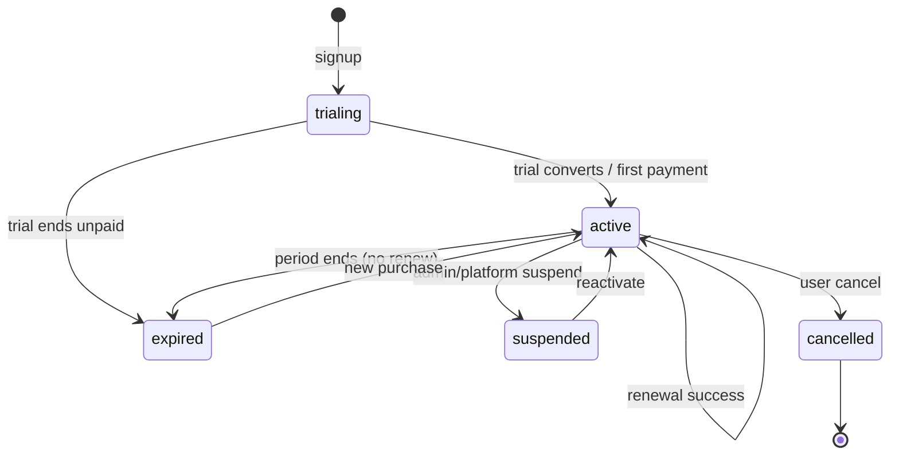

# P2.1 Billing Data Layer

Production database foundation for subscriptions and billing payments.  
**Migration:** `supabase/migrations/010_p2_billing_data_model.sql`

Checkout, payment gateways, webhooks, and UI are **out of scope** for P2.1.

---

## Tables reviewed

### `subscriptions` (existing + hardened)

| Column | Notes |
|--------|--------|
| `status` | `subscription_status` enum |
| `amount`, `currency` | Plan price snapshot |
| `starts_at`, `expires_at` | Current period bounds |
| `auto_renew` | Gateway renewal flag |
| `plan_code` | **P2.1** — e.g. `sanadat_annual` |
| `billing_cycle` | **P2.1** — `monthly` \| `yearly` |
| `next_renewal_at` | **P2.1** — next charge/renewal (UTC) |
| `cancel_at_period_end` | **P2.1** — end at `expires_at`, no renew |
| `cancelled_at`, `cancelled_by` | **P2.1** — cancellation audit |

### `payments` (billing journal — not document vouchers)

| Column | Notes |
|--------|--------|
| `gateway`, `gateway_reference` | Provider + primary reference |
| `status` | `pending` \| `completed` \| `failed` \| `refunded` |
| `provider_event_id` | **P2.1** — webhook idempotency key |
| `checkout_session_id` | **P2.1** — hosted checkout session |
| `payment_intent_id` | **P2.1** — charge/intent id |
| `paid_at`, `failed_at` | **P2.1** — terminal timestamps |
| `failure_code`, `failure_reason` | **P2.1** — provider failure detail |
| `period_start`, `period_end` | **P2.1** — subscription period paid for |

> **Naming:** `payment_vouchers` = business documents; `payments` = SaaS subscription charges.

---

## Subscription lifecycle



| Status | Meaning | Typical `expires_at` |
|--------|---------|----------------------|
| `trialing` | New company trial (14 days on signup); **max 5 documents total** (receipts + payments + invoices, all statuses count) | Trial end |
| `active` | Paid / entitled period | Current period end |
| `expired` | No entitlement | Past |
| `suspended` | Blocked by platform (abuse, non-payment policy) | — |
| `cancelled` | User cancelled; may run until period end if `cancel_at_period_end` | Period end or now |

### Rules

1. **One logical subscription row per company** today (append-only history is a future P2.x option).
2. **`next_renewal_at`** aligns with `expires_at` for yearly plans unless gateway schedules differ.
3. **`cancel_at_period_end = true`** keeps `status = active` until `expires_at`, then move to `expired` or `cancelled` via backend job/RPC (P2.2+).
4. **Activation** (`trialing` → `active`, extend `expires_at`) must **not** be done by the Supabase client — only service role or `SECURITY DEFINER` RPC/webhook handler.
5. **Trial document cap:** While `status = trialing`, tenant may create at most **5** combined documents (`TRIAL_DOCUMENT_LIMIT`). Enforced server-side in document use cases; `GET /api/billing/trial-usage` exposes remaining count. Active subscription removes the cap.

---

## Payment journal rules

1. **Append-oriented:** Prefer inserting a new `payments` row per checkout attempt; update the same row only while `status = pending`.
2. **Terminal states:** `completed`, `failed`, `refunded` are immutable from the tenant client (RLS blocks all client `UPDATE`).
3. **References:**
   - `gateway_reference` — primary id returned at checkout creation.
   - `payment_intent_id` — charge/intent id when available.
   - `checkout_session_id` — session id for redirect flows.
4. **Period linkage:** On success, set `period_start` / `period_end` to match the subscription period being purchased or renewed.
5. **Timestamps:**
   - `paid_at` when `status` becomes `completed`.
   - `failed_at` when `status` becomes `failed` (with `failure_code` / `failure_reason`).
6. **Subscription link:** `subscription_id` must belong to the same `company_id` (enforced in application/RPC layer in P2.2+).

### Unique constraints (idempotency support)

| Index | Purpose |
|-------|---------|
| `(gateway, gateway_reference)` WHERE NOT NULL | One journal row per gateway checkout reference |
| `(gateway, provider_event_id)` WHERE NOT NULL | One row per webhook event id |

Duplicate webhook delivery must **not** create duplicate completed payments.

---

## Webhook idempotency requirements (P2.2+)

When implementing webhooks:

1. **Primary key:** Use `provider_event_id` from the gateway payload (or a stable composite hash if the provider only sends `gateway_reference`).
2. **Processing flow:**
   ```
   receive event → lookup (gateway, provider_event_id)
     → if completed payment exists → 200 OK, no-op
     → if pending exists → update atomically in transaction
     → else insert pending → apply business logic → set completed/failed
   ```
3. **Subscription activation** in the same transaction as marking `payments.status = completed`.
4. **Out-of-order events:** Ignore "failed" after "completed" for the same reference unless provider documents chargebacks (`refunded`).
5. **Service role only:** Webhook route uses Supabase service role or dedicated RPC; never the anon/authenticated client key for activation.
6. **Audit:** Log `billing.payment_completed` / `billing.payment_failed` to `activity_logs` (P2.x).

---

## RLS summary (P2.1)

| Table | SELECT (tenant member) | INSERT/UPDATE/DELETE (client) |
|-------|-------------------------|-------------------------------|
| `subscriptions` | ✅ own `company_id` | ❌ blocked |
| `payments` | ✅ own `company_id` | ❌ blocked |

Platform `platform_admin` / `platform_support` can read subscriptions (support tooling).  
Signup still creates trial subscriptions via `handle_new_user()` (`SECURITY DEFINER`).

---

## Related migrations

| # | File |
|---|------|
| 001 | Initial `subscriptions`, `payments` |
| 004 | `trialing` on `subscription_status` |
| 006 / 010 | Signup trial + plan fields |
| 010 | **P2.1** full hardening |
| 017 | **P2.6.1** discount coupons + redemptions — see [p2-6-1-discount-coupons.md](./p2-6-1-discount-coupons.md) |
| 029 | **P2.8** invitation promo codes + `subscription_source` — see below |

---

## Invitation promo codes (P2.8)

**Migration:** `supabase/migrations/029_p28_invitation_promo_codes.sql`

### Discount coupon vs invitation code

| | Discount coupon | Invitation promo code |
|---|-----------------|----------------------|
| Purpose | Reduce Moyasar checkout amount | Grant free `active` access for N days |
| Payment row | Yes (on successful checkout) | **No** |
| `subscription_source` | Becomes `paid` after payment | `promo` |
| Tables | `discount_coupons`, `coupon_redemptions` | `invitation_promo_codes`, `invitation_promo_redemptions` |

### `subscription_source` on `subscriptions`

| Value | Meaning |
|-------|---------|
| `trial` | Default signup trial |
| `paid` | Moyasar or manual bank transfer |
| `promo` | Invitation code redemption |
| `admin_grant` | Reserved for platform manual grants |

### Promo activation behavior

- `status = active`, `plan_code = sanadat_annual`, `billing_cycle = yearly`
- `starts_at` = now (or unchanged if extending from future `expires_at`)
- `expires_at` = `starts_at + duration_days`
- `next_renewal_at` = `expires_at`, `auto_renew = false`

### Expiry

No new cron in P2.8. Existing subscription guards treat expired promo like any expired subscription. User must pay (Moyasar or manual transfer) to regain access.

---

## Next steps (not P2.1)

- P2.2: Checkout session creation API + pending payment insert (service role)
- P2.3: Webhook handlers + subscription activation RPC
- P2.4: Renewal reminders + expiry jobs
- P2.5: Admin billing visibility
